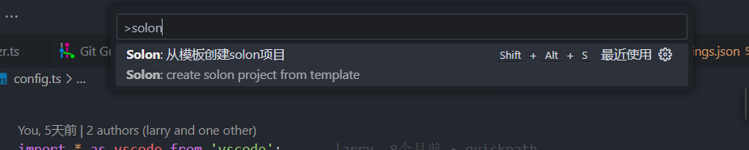
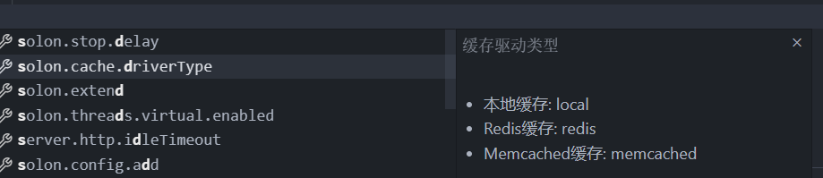

vscode 的 solon 插件

功能：

1. 从模板创建项目

2. 对 yml,yaml 配置文件增加键值提示

vscode plugin for solon

Function:

1. Create a project from a template
2. Add key value prompts to yml and yaml configuration files

other:
base on jdk environment
https://github.com/redhat-developer/vscode-java/wiki/JDK-Requirements#java.configuration.runtimes
